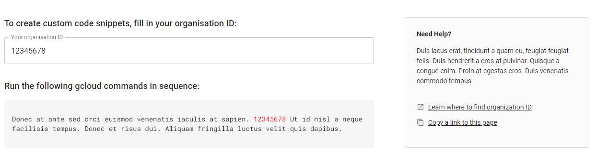

# DoIT Home Assignment

By Harry Ashton

> Make sure to be using `node` version `^16.**.**` to run unit tests

This assignment aims to show the candidates ability to create robust components in the environment we are using at DoiT.

## Goal

Create reusable component(s) based on the mockup found in the following [Figma file](https://www.figma.com/file/kvu15ZtSRfVPyymcWvdVkV/UX-Developer---Task?node-id=1%3A954)

The output of this task should be:

- Bringing the mockup in Figma to life
- Consider splitting it into smaller reusable components using [MUI](https://mui.com) library
- Business logic that pulls the Organization ID from the input into the code component below it
- [OPTIONAL] Consider how this page would look on mobile/smaller screens

This project was bootstrapped with [Create React App](https://github.com/facebook/create-react-app).

## Available Scripts

In the project directory, you can run:

### `npm start`

Runs the app in the development mode.\
Open [http://localhost:3000](http://localhost:3000) to view it in the browser.

The page will reload if you make edits.\
You will also see any lint errors in the console.

### `npm test`

> Make sure to be using `node` version `^16.**.**`

Launches the test runner in the interactive watch mode.\
See the section about [running tests](https://facebook.github.io/create-react-app/docs/running-tests) for more information.

## Learn More

[MUI Documentation](https://mui.com/material-ui/getting-started/usage/)
[Create React App documentation](https://facebook.github.io/create-react-app/docs/getting-started)
